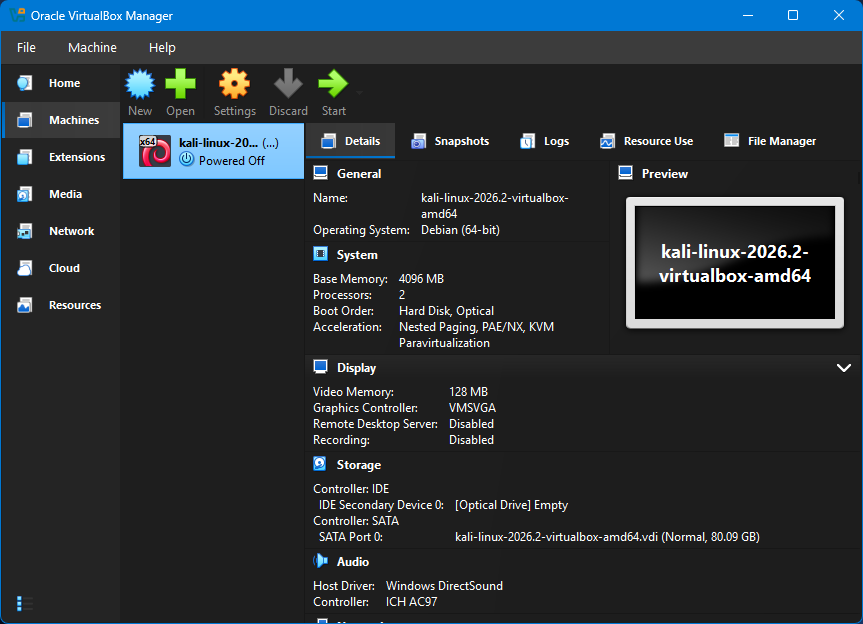
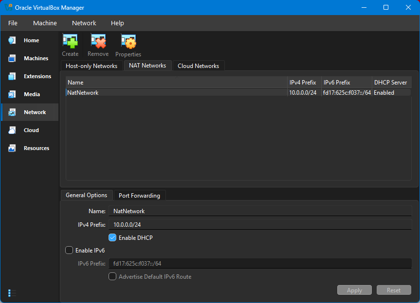
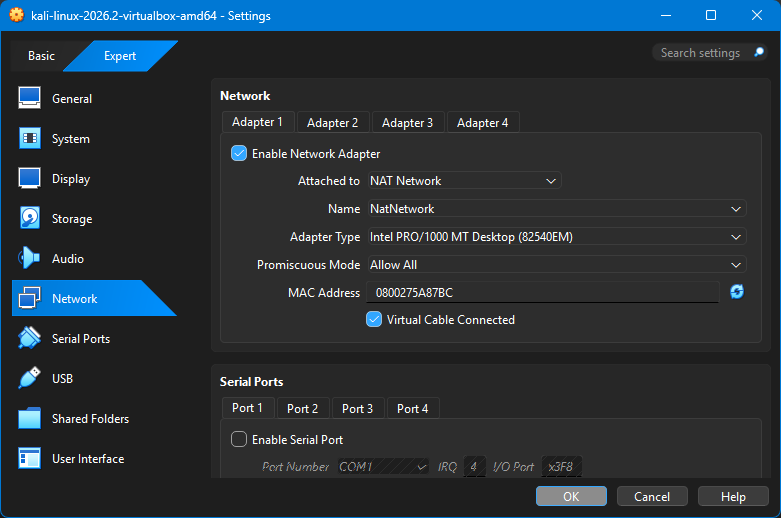
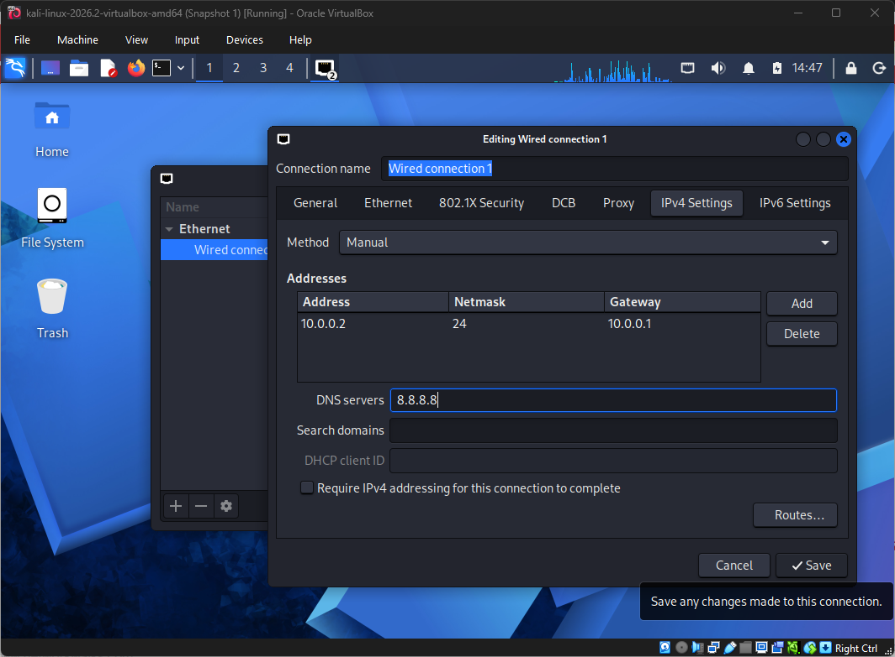
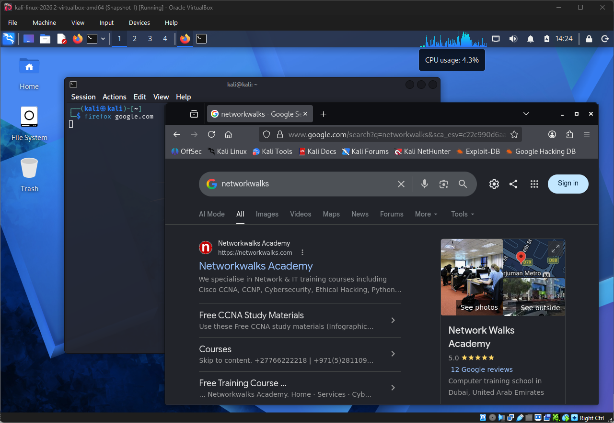
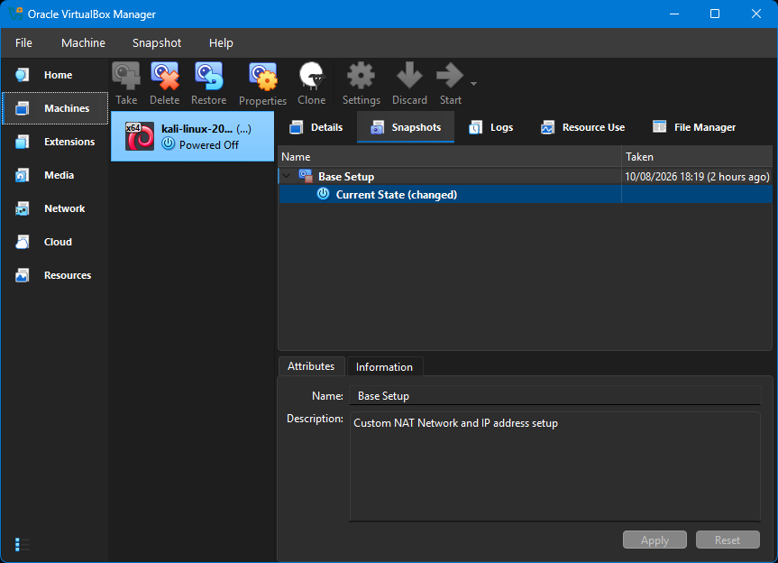
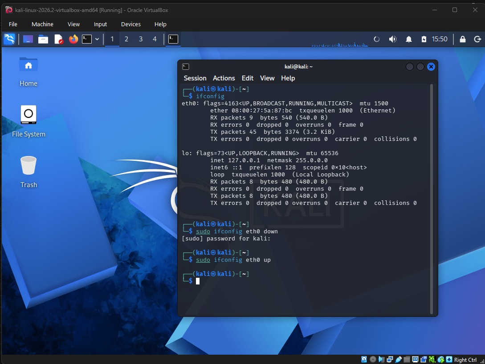
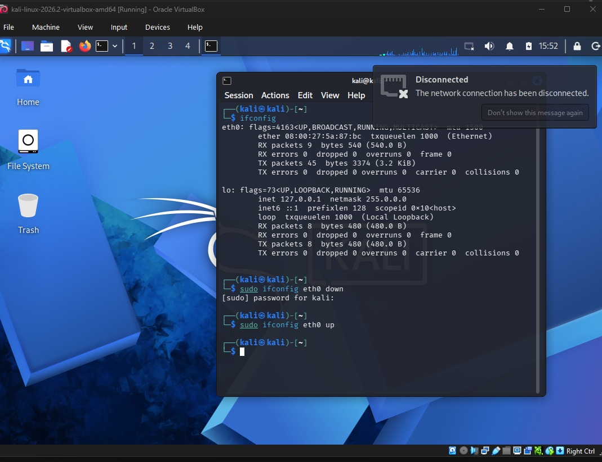
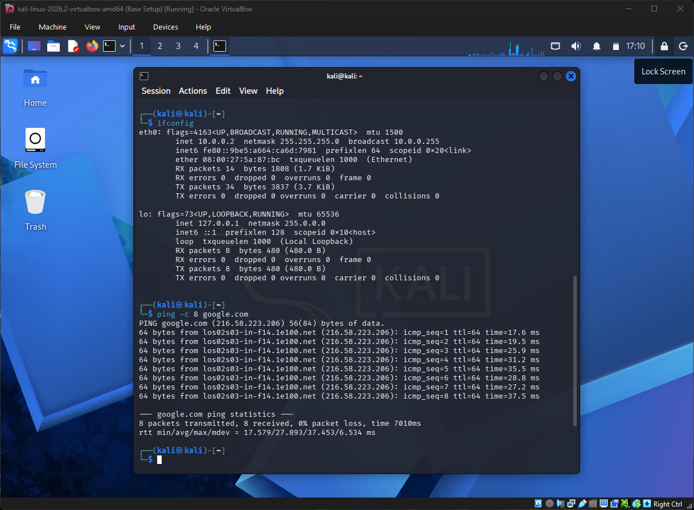

# Cybersecurity Home Lab Setup — Phase 1

**NETWORKWALKS Cybersecurity Internship — Week 1**

Building and configuring the first virtual machine in a controlled cybersecurity home lab using **Oracle VirtualBox** and **Kali Linux**, including custom virtual networking, static IPv4 configuration, connectivity testing, troubleshooting, and snapshot-based recovery.

## Project Summary

| Item | Details |
|---|---|
| Hypervisor | Oracle VirtualBox |
| Guest OS | Kali Linux 2026.2 |
| Network Type | Custom NAT Network |
| Network Name | `NatNetwork` |
| Subnet | `10.0.0.0/24` |
| Kali IPv4 Address | `10.0.0.2/24` |
| Default Gateway | `10.0.0.1` |
| DNS Server | `8.8.8.8` |
| Key Task | Static IPv4 configuration |
| Troubleshooting | Network connection failure after applying static IPv4 settings |
| Recovery | VirtualBox snapshot |

## Project Objective

Set up the first virtual machine for a cybersecurity home lab using Oracle VirtualBox and Kali Linux.

Phase 1 covered:

- Setting up Oracle VirtualBox
- Importing Kali Linux 2026.2
- Creating a custom NAT network
- Connecting the Kali VM to the custom NAT network
- Configuring static IPv4 settings
- Verifying network and internet connectivity
- Creating a VirtualBox snapshot as a stable recovery point

## Project Purpose

The purpose of this project is to build a controlled virtual environment for practical cybersecurity learning and authorised security testing.

The lab provides a foundation for activities such as:

- Network reconnaissance and scanning
- Vulnerability assessment
- Packet analysis
- Security-tool experimentation
- Penetration-testing exercises
- Malware analysis in a more isolated lab environment

By creating a dedicated virtual network, the lab systems can be separated from the host's physical network while still allowing controlled communication between virtual machines and external network access where required.

This provides a safer and more manageable environment for future cybersecurity exercises as additional systems are added to the lab.

---

## Environment

| Component | Configuration |
|---|---|
| Hypervisor | Oracle VirtualBox |
| Guest OS | Kali Linux 2026.2 |
| Network Type | NAT Network |
| NAT Network Name | `NatNetwork` |
| Network | `10.0.0.0/24` |
| Kali IPv4 Address | `10.0.0.2/24` |
| Default Gateway | `10.0.0.1` |
| DNS Server | `8.8.8.8` |

---

## 1. Import Kali Linux

Kali Linux 2026.2 was downloaded and imported into Oracle VirtualBox as the first virtual machine in the cybersecurity home lab.



---

## 2. Create the Custom NAT Network

A custom VirtualBox NAT network named `NatNetwork` was created with the following IPv4 network:

```text
10.0.0.0/24
```

The NAT network provides the virtual lab environment with network connectivity while keeping it logically separated from the host's physical network.



---

## 3. Configure the Kali Network Adapter

The Kali VM's virtual network adapter was attached to the custom NAT network.

Configuration:

- Network Adapter: Enabled
- Attached to: NAT Network
- Network Name: `NatNetwork`
- Virtual Cable: Connected



---

## 4. Configure Kali IPv4 Settings

The Kali VM was configured with manual IPv4 settings.

```text
IP Address:      10.0.0.2
Prefix Length:   /24
Default Gateway: 10.0.0.1
DNS Server:      8.8.8.8
```



---

## 5. Verify Connectivity

The Kali VM was started after the network configuration was applied.

External network connectivity and DNS resolution were verified by successfully accessing an external website from the Kali VM.



---

## 6. Create a Stable Snapshot

After confirming that the Kali VM and its network configuration were functioning correctly, a VirtualBox snapshot was created.

The snapshot provides a stable recovery point before making further changes to the lab environment.



---

## Problem Encountered and Resolution

### Static IPv4 Configuration Caused the Network Connection to Fail

While configuring the Kali VM, I encountered a network issue after changing the IPv4 configuration from the default automatic DHCP settings to the required static configuration.

The Kali VM was configured with:

```text
IP Address:      10.0.0.2/24
Default Gateway: 10.0.0.1
DNS Server:      8.8.8.8
```

After applying the new settings, I restarted the `eth0` network interface using:

```bash
sudo ifconfig eth0 down
sudo ifconfig eth0 up
```

However, after the interface went down, the network connection did not recover. Kali continued attempting to reconnect and eventually reported that the network connection had been disconnected.





### Troubleshooting

I first tried a basic troubleshooting step by shutting down and restarting the Kali VM, but the problem remained.

I then changed the IPv4 configuration back to its default automatic DHCP setting. The network connection was restored successfully.

To further isolate the problem, I reapplied the required static IPv4 configuration. The connection failed again.

This showed that the issue was specifically occurring when the custom static IPv4 configuration was being activated, rather than being a general failure of the Kali VM, its virtual network adapter, or the VirtualBox NAT network.

At this point, I contacted the instructor and explained the behaviour I was experiencing.

### Resolution

I was directed to apply the following NetworkManager command:

```bash
sudo nmcli connection modify "Wired connection 1" ipv4.dad-timeout 0
```

After applying the command and restarting the network connection, the Kali VM successfully connected using the custom static IPv4 configuration.

I then verified the network interface and confirmed that the configured IP address `10.0.0.2` had been applied successfully.



### What I Took From the Issue

The issue gave me practical experience in isolating a network configuration problem rather than assuming that the entire virtual network had failed.

Reverting to DHCP restored connectivity, while reapplying the static configuration reproduced the problem. This helped narrow the issue down to the activation of the custom IPv4 configuration before I escalated it for guidance.

It also reinforced the importance of verifying network changes after applying them and documenting both the problem and its resolution.

---

## What I Learned

I had already worked with virtual machines and Kali Linux before this project. My personal setup used VMware Workstation with Kali Linux 2026.1, and I was already familiar with basic Linux commands such as `pwd`, `ls`, `cd`, `cat`, and `man`.

What was new to me in this project was how those familiar technologies could be configured and documented more deliberately for a cybersecurity lab.

### 1. Using GitHub as a Cybersecurity Project Portfolio

Before this project, I mainly viewed GitHub as a platform for hosting code.

I had not really considered documenting a practical cybersecurity lab as a GitHub project, with a structured README, screenshots, configuration details, troubleshooting notes, and evidence of completed work.

This project introduced me to using GitHub as a technical portfolio for documenting and presenting practical cybersecurity projects in a clear and reproducible way.

### 2. Creating a Custom Virtual Network

My previous virtual machines mostly used the default VMware network configuration. When I encountered connectivity problems in the past, I would usually switch the VM to bridged networking.

In this project, I learned how to deliberately create and configure a custom NAT network for the lab instead of relying on the default virtual network settings.

The network was created as `NatNetwork` using the `10.0.0.0/24` address range.

This helped me understand the importance of planning the network environment of a cybersecurity lab rather than simply connecting every virtual machine directly to the same network as the host.

Using a dedicated virtual network provides greater separation from the host's physical network and gives better control over how the lab machines communicate. This becomes especially important when the environment is later used for activities such as penetration testing, vulnerability testing, and malware analysis.

### 3. Virtual Machine Snapshots

Snapshots were completely new to me.

Although I had created and used Kali virtual machines before, I had never created a VM snapshot and was not aware of how useful the feature could be.

I learned that a snapshot allows me to preserve a known working state of a virtual machine and return to it if later configuration changes, experiments, or security exercises break the system.

For a cybersecurity lab, this provides a practical recovery point before carrying out potentially disruptive work.

### 4. Manually Restarting a Network Interface

I also learned how to manually bring a network interface down and back up from the terminal using:

```bash
sudo ifconfig eth0 down
sudo ifconfig eth0 up
```

In this project, these commands were used after changing the Kali network configuration so that the interface could restart and apply the updated settings.

The connectivity problem I encountered while doing this also gave me practical experience in troubleshooting a network configuration instead of assuming that the settings had been applied successfully.

---

## Next Phase

The home lab will be expanded with additional virtual systems:

- Windows
- Android

These systems will be integrated into the lab environment during the next phase of the project.

---

## Repository Structure

```text
.
├── screenshots/
│   ├── 01-kali-imported-virtualbox.png
│   ├── 02-custom-nat-network.png
│   ├── 03-kali-network-adapter.png
│   ├── 04-kali-ip-configuration.png
│   ├── 05-kali-connectivity-test.png
│   ├── 06-kali-snapshot.png
│   ├── 07-static-ip-connection-failure.png
│   ├── 08-network-disconnected.png
│   └── 09-static-ip-resolution-verification.png
└── README.md
```

## Author

**Prince Manu Gyebi**  
Cybersecurity Intern — Batch B082  
**NETWORKWALKS**

LinkedIn: [Prince Manu Gyebi](https://www.linkedin.com/in/princemanugyebi)
